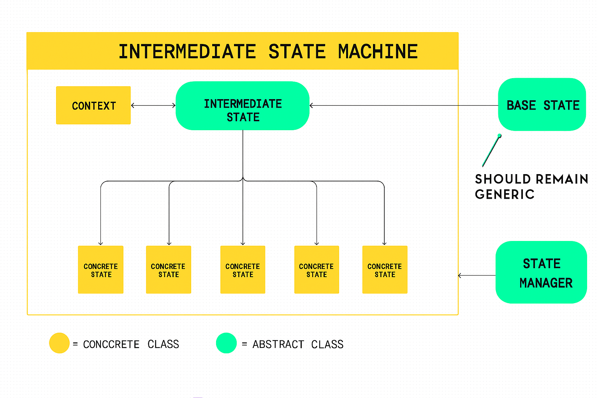

# State-Machine
***Base system to create a state framework, including an abstract class BaseState 
and an abstract class StateMachine. For using, recommend creating an intermediate abstract class State inheriting from the BaseState to add more logic.***

BASESTATE INCLUDES:
- 🟢StateKey: a key equivalent to each State for StateMachine managing
- 🔴abstract EnterState(): Methods called once when a State is entered
- 🔴abstract UpdateState(): Method called every frame while in the State
- 🔴abstract ExitState(): Methods called once when a State is exited
- 🔴abstract EState GenerateNextState(): Method to generate the next state based on the current state logic.
  
STATEMANAGER INCLUDES:
- 🟢CurrentState: The current state of the state machine
- ⚡event OnStateChanged(fromStateKey, toStateKey): Callback fired whenever state changes
- 🔴abstract InitializeStates(): register all states by using AddStates()
- 🔴abstract InitializeEntryState(): Define the entry state
- 🟢AddStates(states): Add states to the state machine
- 🟢RemoveStates(states): Remove states from the state machine
- 🟢GetState(Estate) get state from key
- 🟡virtual OnAwake(): Method is called in Awake()
- 🟡virtual OnStart(): Method is called in Start()

  